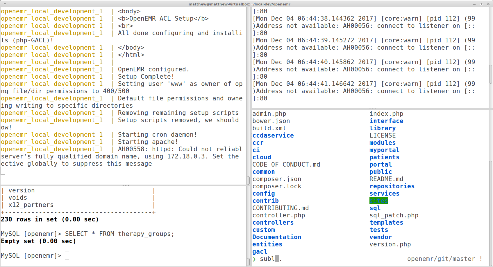

# OpenEMR Local Development Docker

This is a development Docker Compose solution for programming OpenEMR. New and existing contributors can enjoy the benefits of simply pulling down their fork and running a single command to get coding!



### Temporary Notes

- Once this is properly tested and vetted, it will be checked into the OpenEMR repo in a build folder and dev.open-emr.org will contain quick start documentation.

## Setup

Install [docker](https://www.docker.com/get-docker) and [compose](https://docs.docker.com/compose/install/).

```
$ # clone and cd into this repo :)
$ git clone git@github.com:YOUR_USERNAME/openemr.git # must be based off of the latest master branch
$ docker build -t openemr_local_development .
$ docker-compose up
```

## Usage

(need to detail everything here......)
How to tail logs
How to get bash access
MySQL access mysql -u root --password=root and through workbench
Usage of composer/bower (are these installed.... actually, I need to add them)
Usage of seeder???
Reset everything with git checkout, git clean -f -d, docker kill
Breakpoints


## License

GPL
